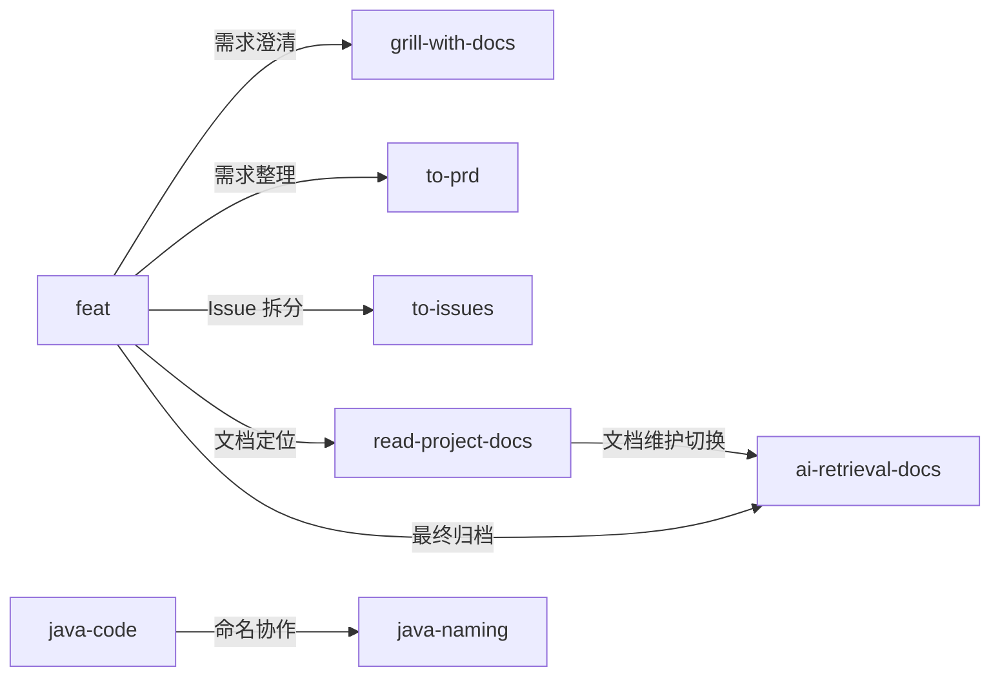

# 1. Codex Profile

这个仓库用于同步个人 Codex 全局配置，只保存可迁移的配置源码。

**重要提示：执行 `python install.py` 真实安装时，`profile/skills/` 中的同名 Skill 会整体替换本机 `~/.codex/skills/` 下的对应 Skill，不会合并目录，也不会保留本机同名 Skill 目录中的额外文件。请先使用 `python install.py --dry-run` 确认同步范围。**

当前包含：

- `AGENTS.md`：当前仓库的 AI 操作规则
- `profile/AGENTS.md`：个人 Codex 全局规则
- `profile/skills/`：个人自定义 Skills
- `install.py`：Windows、macOS、Linux 通用安装脚本

# 2. 使用和更新方式

`install.py` 会把 `profile/AGENTS.md` 和 `profile/skills/` 复制到当前用户的 `~/.codex` 目录。

常用命令：

```powershell
# 安装或同步到默认 Codex 目录
python install.py

# 预演安装计划
python install.py --dry-run

# 安装到指定目录
python install.py --codex-home C:\Users\YourName\.codex
```

更新流程：

```powershell
git add .
git commit -m "更新 Codex 配置"
git push

git pull
python install.py
```

# 3. Skill 软依赖关系

部分 Skill 之间存在软依赖关系。软依赖不是运行时强制依赖，而是在职责边界处提示切换或配合使用另一个 Skill。使用或安装时不要禁用被依赖的 Skill，否则相关任务会失去完整指引。



`feat` 是 AI Coding 主控工作流 Skill。它会先执行工作流前置检查，只显式关联工作流必要 Skill：项目安装了 `mattpocock/skills` 时可编排 `setup-matt-pocock-skills`、`grill-with-docs`、`to-prd` 和 `to-issues`，实现阶段使用本仓库的 `read-project-docs` 定位并渐进读取相关文档，并在改代码前完成代码事实校验；Issue 完成阶段处理 Review 结果门禁，最终归档阶段配合本仓库的 `ai-retrieval-docs`。具体实现类 Skill 由项目技术栈、用户偏好和已安装 Skill 决定，不在 `feat` 中硬编码。

# 4. Skill 列表

当前仓库包含以下 Skill。新增 Skill 时应按职责归入已有类别；如果不适合现有类别，再新增类别。

## 4.1 Feat 工作流技能

| 名称 | 类型 | 一句话用途 |
| --- | --- | --- |
| `setup-matt-pocock-skills` | 外部依赖 | 初始化项目的 Agent Skill 说明、Issue tracker 和领域文档布局。 |
| `grill-with-docs` | 外部依赖 | 基于需求文档和项目领域文档澄清需求。 |
| `to-prd` | 外部依赖 | 按 PRD 结构整理和完善当前需求文档。 |
| `to-issues` | 外部依赖 | 将需求拆分为可独立实现的垂直切片 Issue。 |
| `feat` | 本仓库维护 | 编排需求澄清、Issue 拆分、实现门禁、Review 和归档。 |
| `ai-retrieval-docs` | 本仓库维护 | 维护面向未来 AI 的检索文档和上下文入口。 |

<details>
<summary><code>feat</code>：AI Coding 主控工作流</summary>

触发场景：

用户明确要求使用 `feat`、`$feat` 并描述新需求时，才新建 `feat` 工作流并创建需求文档草稿；在已有 `feat` 需求文档、Issue 或 `.issue/` 等产物上下文中继续下一步时，按现有产物续跑。普通「新增功能」「实现需求」请求不自动进入 `feat`；如果请求看起来需要完整需求建档、澄清、拆分或实现门禁流程，但没有明确调用 `feat`，先询问用户确认。

作用：

作为 AI Coding 主控工作流，执行工作流前置检查，编排轻量需求草稿、需求澄清、PRD 完善、文档边界、Feature DoR、Issue DoR / DoD、垂直 Issue 拆分、实现阶段文档定位、实现前代码事实校验、Review 结果门禁、Issue 实现沉淀和最终 AI 检索文档归档；不硬编码具体实现类 Skill。

</details>

<details>
<summary><code>ai-retrieval-docs</code>：AI 检索文档维护</summary>

触发场景：

需求、代码变更、已有 AI 检索文档或上下文入口需要更新为未来 AI 可读事实时触发；维护项目级 AI 检索或上下文文档时也触发。

作用：

维护中文 AI 检索文档、AI 排查文档、AI 上下文入口和 AI 检索入口，记录代码事实、执行链路、兼容边界、验证命令和检索关键词；也是 `feat` 工作流最终归档阶段使用的 Skill。

</details>

## 4.2 编码技能

| 名称 | 一句话用途 |
| --- | --- |
| `java-naming` | 设计和评审 Java 后端命名。 |
| `coding-guidelines` | 约束编码任务小步实现、显式假设和验证交付。 |
| `read-project-docs` | 渐进读取项目文档、需求目录和 AI 上下文入口。 |
| `java-code` | 指导 Java 后端代码修改、测试和验证反馈。 |

<details>
<summary><code>java-naming</code>：Java 后端命名</summary>

触发场景：

需要设计、评审、重命名或放置 Java 后端包路径、类名、接口名、实现类名、方法名、变量名、常量名和职责后缀时触发。

作用：

为 Java 后端代码提供渐进加载的包、类、方法、变量、常量命名规则；允许语义明确的 `Dto` 和 `Dao`，避免默认引入 `VO`、`DO`、`PO`、`BO`、`POJO` 等后缀体系。

</details>

<details>
<summary><code>coding-guidelines</code>：编码任务执行约束</summary>

触发场景：

实现、调试、修复 Bug、重构、补测试、代码评审、澄清模糊需求，或用户要求小步修改、最小改动、显式假设、验证交付时触发。

作用：

约束编码任务先明确假设和目标，再用 KISS 原则完成小范围改动，并用测试、构建或明确检查点验证结果。

</details>

<details>
<summary><code>read-project-docs</code>：项目文档渐进读取</summary>

触发场景：

需要读取文档目录、需求目录、AI 上下文入口、AI 检索入口、`README.md`、`index.md`、设计文档集、实现记录或混合项目文档时触发。

作用：

先查看目录文件列表和入口文档，再按入口路由渐进读取相关文档，避免一次性加载同目录下全部 Markdown 文档。

</details>

<details>
<summary><code>java-code</code>：Java 后端代码修改</summary>

触发场景：

需要编写、修改、重构或测试 Java 8、Spring、Spring Boot、Spring MVC、MyBatis、Jackson、Lombok 后端代码或测试时触发。

作用：

指导 Java 后端代码修改流程、结构命名、兼容边界、Web 与 MyBatis 约定、日志、类注释、测试和验证反馈。

</details>

## 4.3 通用技能

| 名称 | 一句话用途 |
| --- | --- |
| `chinese-markdown` | 约束中文 Markdown 的排版、标题和行内语法。 |
| `node-fetch-http` | 使用 Node.js 内置 `fetch` 调用、测试和验证 HTTP/API。 |

<details>
<summary><code>chinese-markdown</code>：中文 Markdown 写作</summary>

触发场景：

创建、修改、格式化或审查中文 Markdown 文章、需求、`README.md`、设计文档、AI 文档、Skill 文档或检查清单时触发。

作用：

约束中文 Markdown 的引号、空格、行内语法间距、标题层级和标题编号，保持文档排版一致。

</details>

<details>
<summary><code>node-fetch-http</code>：HTTP/API 调用验证</summary>

触发场景：

在 Codex 中调用、测试、验证、请求、POST 或检查 HTTP/API 接口，尤其是需要 Cookie、Bearer Token、JSON 请求体、多接口串联或接口结果校验时触发。

作用：

约束 HTTP/API 调用默认使用 Node.js 内置 `fetch`，通过环境变量传入敏感值，并提供紧凑 JSON 输出的请求脚本模板。

</details>

# 5. 不同步内容

不要把 Codex 运行时状态放进本仓库，例如：

- `sessions/`
- `archived_sessions/`
- `log/`
- `tmp/`
- `sqlite/`
- `plugins/`
- `*.sqlite`
- `history.jsonl`

这些内容通常和本机状态、缓存、会话历史或安装环境相关，不适合跨机器共享。
