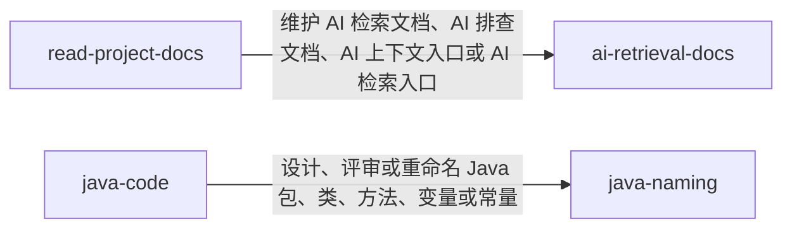

# 1. Codex Profile

这个仓库用于同步个人 Codex 全局配置，只保存可迁移的配置源码。

当前包含：

- `AGENTS.md`：当前仓库的 AI 操作规则
- `profile/AGENTS.md`：个人 Codex 全局规则
- `profile/skills/`：个人自定义 Skills
- `install.py`：Windows、macOS、Linux 通用安装脚本

# 2. 使用和更新方式

`install.py` 会把 `profile/AGENTS.md` 和 `profile/skills/` 复制到当前用户的 `~/.codex` 目录。

常用命令：

```powershell
# 安装或同步到默认 Codex 目录
python install.py

# 预演安装计划
python install.py --dry-run

# 安装到指定目录
python install.py --codex-home C:\Users\YourName\.codex
```

更新流程：

```powershell
git add .
git commit -m "更新 Codex 配置"
git push

git pull
python install.py
```

# 3. Skill 软依赖关系

部分 Skill 之间存在软依赖关系。软依赖不是运行时强制依赖，而是在职责边界处提示切换或配合使用另一个 Skill。使用或安装时不要禁用被依赖的 Skill，否则相关任务会失去完整指引。



# 4. Skill 列表

当前仓库包含以下 Skill：

| Skill | 触发场景 | 作用 |
| --- | --- | --- |
| `java-naming` | 需要设计、评审、重命名或放置 Java 后端包路径、类名、接口名、实现类名、方法名、变量名、常量名和职责后缀时触发。 | 为 Java 后端代码提供渐进加载的包、类、方法、变量、常量命名规则；允许语义明确的 `Dto` 和 `Dao`，避免默认引入 `VO`、`DO`、`PO`、`BO`、`POJO` 等后缀体系。 |
| `coding-guidelines` | 实现、调试、修复 Bug、重构、补测试、代码评审、澄清模糊需求，或用户要求小步修改、最小改动、显式假设、验证交付时触发。 | 约束编码任务先明确假设和目标，再用 KISS 原则完成小范围改动，并用测试、构建或明确检查点验证结果。 |
| `ai-retrieval-docs` | 需求、代码变更、已有 AI 检索文档或上下文入口需要更新为未来 AI 可读事实时触发；维护项目级 AI 检索或上下文文档时也触发。 | 维护中文 AI 检索文档、AI 排查文档、AI 上下文入口和 AI 检索入口，记录代码事实、执行链路、兼容边界、验证命令和检索关键词。 |
| `read-project-docs` | 需要读取文档目录、需求目录、AI 上下文入口、AI 检索入口、`README.md`、`index.md`、设计文档集、实现记录或混合项目文档时触发。 | 先查看目录文件列表和入口文档，再按入口路由渐进读取相关文档，避免一次性加载同目录下全部 Markdown 文档。 |
| `chinese-markdown` | 创建、修改、格式化或审查中文 Markdown 文章、需求、`README.md`、设计文档、AI 文档、Skill 文档或检查清单时触发。 | 约束中文 Markdown 的引号、空格、行内语法间距、标题层级和标题编号，保持文档排版一致。 |
| `java-code` | 需要编写、修改、重构或测试 Java 8、Spring、Spring Boot、Spring MVC、MyBatis、Jackson、Lombok 后端代码或测试时触发。 | 指导 Java 后端代码修改流程、结构命名、兼容边界、Web 与 MyBatis 约定、日志、类注释、测试和验证反馈。 |

# 5. 不同步内容

不要把 Codex 运行时状态放进本仓库，例如：

- `sessions/`
- `archived_sessions/`
- `log/`
- `tmp/`
- `sqlite/`
- `plugins/`
- `*.sqlite`
- `history.jsonl`

这些内容通常和本机状态、缓存、会话历史或安装环境相关，不适合跨机器共享。
