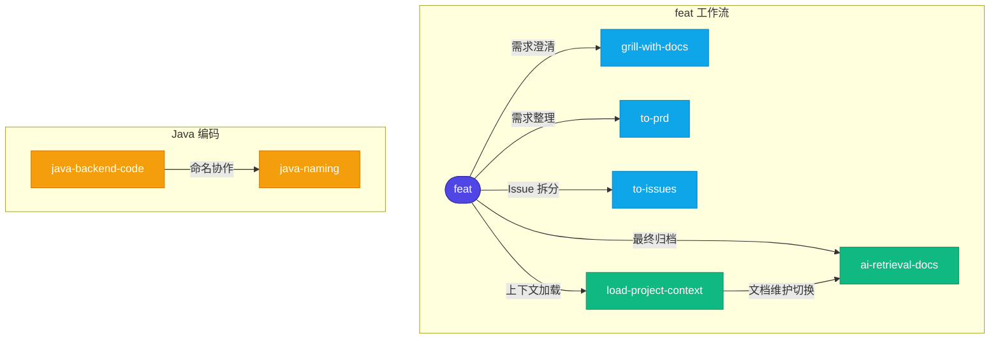
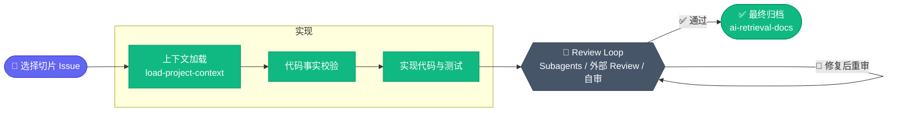

# Codex Profile

个人 Codex 全局配置的备份仓库。

> [!WARNING]
> 执行 `python install.py` 真实安装时，`profile/skills/` 中的同名 Skill 会 **整体替换** 本机 `~/.codex/skills/` 下的对应目录，不会合并，也不会保留本机的额外文件；脚本上次安装过、但当前 `profile/skills/` 已不存在的 Skill 也会被删除。请先用 `python install.py --dry-run` 确认同步范围再执行。

当前包含：

- `AGENTS.md`：当前仓库的规则（约束 AI 在本仓库的行为）
- `profile/AGENTS.md`：个人 Codex 全局规则
- `profile/skills/`：个人自定义 Skills
- `install.py`：Windows、macOS、Linux 通用安装脚本

# 使用和更新方式

`install.py` 会把 `profile/AGENTS.md` 和 `profile/skills/` 复制到当前用户的 `~/.codex` 目录。

常用命令：

```powershell
# 安装或同步到默认 Codex 目录
python install.py

# 预演安装计划
python install.py --dry-run

# 安装到指定目录
python install.py --codex-home C:\Users\YourName\.codex
```

更新流程：

```powershell
# ── 推送本地修改 ──
git add .
git commit -m "更新 Codex 配置"
git push

# ── 拉取远端更新并安装 ──
git pull
python install.py
```

# Skill 软依赖关系

部分 Skill 在职责边界处会提示切换到另一个 Skill，安装时建议一并保留。



具体用哪些编码 Skill 由项目技术栈决定。

# Skill 列表

## feat 工作流技能

外部依赖来自 [mattpocock/skills](https://github.com/mattpocock/skills)。

| 名称 | 类型 | 一句话用途 |
| --- | --- | --- |
| `setup-matt-pocock-skills` | 外部依赖 | 初始化项目的 Skill 说明、Issue tracker 和领域文档目录结构。 |
| `grill-with-docs` | 外部依赖 | 基于需求文档和项目领域文档澄清需求。 |
| `to-prd` | 外部依赖 | 按 PRD 结构整理和完善当前需求文档。 |
| `to-issues` | 外部依赖 | 将需求拆分为可独立实现的垂直切片 Issue。 |
| `feat` | 本仓库维护 | 编排需求澄清、Issue 拆分、实现门禁、Review 循环和归档。 |
| `load-project-context` | 本仓库维护 | 按入口、术语和 Workspace 边界按需加载项目上下文，用于实现阶段上下文加载。 |
| `ai-retrieval-docs` | 本仓库维护 | 维护项目检索文档，方便后续快速定位上下文。 |

<details>
<summary>🔄 &nbsp;<b>feat 工作流详细阶段图</b></summary>

**① 需求阶段**


**② 实现阶段**



</details>

## 编码技能

| 名称 | 一句话用途 |
| --- | --- |
| `java-naming` | 设计和评审 Java 后端命名。 |
| `coding-guidelines` | 约束编码任务小步实现、显式假设和验证交付。 |
| `java-backend-code` | 指导 Java 后端代码修改、测试和验证反馈。 |

## 通用技能

| 名称 | 一句话用途 |
| --- | --- |
| `chinese-markdown` | 约束中文 Markdown 的排版、标题和行内语法。 |
| `node-http-fetch` | 使用 Node.js 内置 `fetch` 调用、测试和验证 HTTP/API。 |

# 不同步内容

以下内容不纳入同步，通常和本机状态、缓存或会话历史相关：

`sessions/`、`archived_sessions/`、`log/`、`tmp/`、`sqlite/`、`plugins/`、`*.sqlite`、`history.jsonl`
