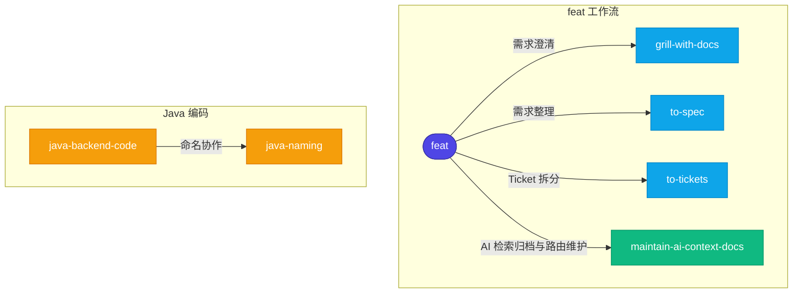
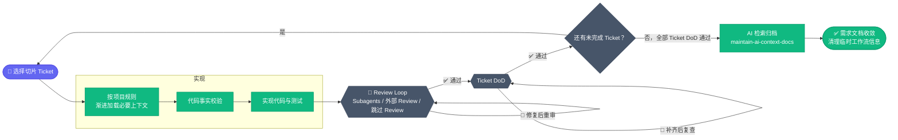

# Codex Profile

个人 Codex 全局规则和共享 Skills 的备份仓库，另附可公开同步的 OpenCode 配置。

> [!WARNING]
> 执行 `python install.py` 真实安装时，`profile/skills/` 中的同名 Skill 会 **整体替换** 本机 `~/.agents/skills/` 下的对应目录，不会合并，也不会保留本机的额外文件；脚本上次安装过、但当前 `profile/skills/` 已不存在的 Skill 也会被删除。`profile/codex-global-rules.md` 会覆盖 `~/.codex/AGENTS.md`。请先用 `python install.py --dry-run` 确认同步范围，真实执行时会再提示确认。

当前包含：

- `AGENTS.md`：当前仓库的规则（约束 AI 在本仓库的行为）
- `CHANGELOG.md`：重要更新、影响范围和必要操作的记录
- `profile/codex-global-rules.md`：个人 Codex 全局规则
- `profile/skills/`：个人自定义 Skills（Codex 和 OpenCode 共用）
- `prompts/`：尚未充分验证或暂不足以沉淀为 Skill 的提示词
- `opencode/`：可公开同步的 OpenCode 配置及独立安装说明
- `install.py`：Windows、macOS、Linux 通用 Codex 安装入口

# 使用和更新方式

根目录 `install.py` 会把 `profile/codex-global-rules.md` 复制为 `~/.codex/AGENTS.md`，把 `profile/skills/` 复制到 `~/.agents/skills/`。OpenCode 配置独立同步，详细说明见 [`opencode/README.md`](opencode/README.md)。

常用命令：

```powershell
# 安装或同步全局规则和 Skills
python install.py

# 预演安装计划
python install.py --dry-run

# 自定义全局规则和 Skills 的安装位置
python install.py --codex-home C:\Users\YourName\.codex --agents-home C:\Users\YourName\.agents

# 跳过交互确认
python install.py --yes
```

从旧版本升级（Skills 曾安装到 `~/.codex/skills/`）时，先运行一次清理脚本，再安装：

```powershell
python scripts/cleanup_legacy_codex_skills.py --dry-run
python scripts/cleanup_legacy_codex_skills.py
python install.py
```

清理脚本同样会在删除前要求确认，可用 `--yes` 跳过。

# Skill 软依赖关系

部分 Skill 在职责边界处会提示切换到另一个 Skill，安装时建议一并保留。


```mermaid
flowchart TD
    subgraph feat_workflow ["feat 工作流"]
        feat(["feat"])
        grillWithDocs["grill-with-docs"]
        toSpec["to-spec"]
        toTickets["to-tickets"]
        maintainAiContextDocs["maintain-ai-context-docs"]
    end

    subgraph java_coding ["Java 编码"]
        javaBackendCode["java-backend-code"]
        javaNaming["java-naming"]
    end

    feat -->|需求澄清| grillWithDocs
    feat -->|需求整理| toSpec
    feat -->|Ticket 拆分| toTickets
    feat -->|AI 检索归档与路由维护| maintainAiContextDocs
    javaBackendCode -->|命名协作| javaNaming

    style feat fill:#4f46e5,color:#fff,stroke:#3730a3
    style grillWithDocs fill:#0ea5e9,color:#fff,stroke:#0284c7
    style toSpec fill:#0ea5e9,color:#fff,stroke:#0284c7
    style toTickets fill:#0ea5e9,color:#fff,stroke:#0284c7
    style maintainAiContextDocs fill:#10b981,color:#fff,stroke:#059669
    style javaBackendCode fill:#f59e0b,color:#fff,stroke:#d97706
    style javaNaming fill:#f59e0b,color:#fff,stroke:#d97706
```

`maintain-ai-context-docs` 负责生产和维护 AI 上下文入口、检索入口、检索说明，以及项目既有启动承载文档中的必要上下文路由。普通任务直接遵循项目已有规则和入口渐进加载上下文，不再依赖独立的上下文消费 Skill。

具体用哪些编码 Skill 由项目技术栈决定。

# Skill 列表

## feat 工作流技能

这套个人工作流的设计背景、使用方式和实践取舍，可参考文章：[AI 保守派的编码实践](https://mofan212.github.io/posts/AI-Coding-The-Conservative-Way/)。

外部依赖来自 [mattpocock/skills](https://github.com/mattpocock/skills)。

| 名称 | 类型 | 一句话用途 |
| --- | --- | --- |
| `setup-matt-pocock-skills` | 外部依赖 | 初始化项目的 Skill 说明、Ticket 承载位置和领域文档目录结构 |
| `grill-with-docs` | 外部依赖 | 基于需求文档和项目领域文档澄清需求 |
| `to-spec` | 外部依赖 | 按 Spec 结构整理和完善当前需求文档 |
| `to-tickets` | 外部依赖 | 将需求或 Spec 拆分为带阻塞关系的垂直切片 Ticket |
| `feat` | 本仓库维护 | 仅通过 `$feat` 手动调用，编排需求澄清、Ticket 拆分、实现门禁、Review、AI 检索归档和需求文档收敛 |
| `maintain-ai-context-docs` | 本仓库维护 | 生产和维护 AI 检索文档、上下文入口及项目既有启动路由的连通性 |

`feat` 将未完成 Feature 的最小状态保存到需求文档同级的 `.feat-tmp/<需求序号>-feat-state.md`，Ticket 实现沉淀保存到 `.feat-tmp/tickets/<需求序号>-*-实现沉淀.md`；完成时只清理当前需求序号对应的文件。

<details>
<summary>🔄 &nbsp;<b>feat 工作流详细阶段图</b></summary>

**① 需求阶段**


```mermaid
flowchart LR
    request(["📋 用户需求"])
    precheck{{"⚙️ 前置检查"}}
    docs["确定目标目录\n计算目录内序号"]

    subgraph clarify ["需求澄清"]
        grill["需求澄清\ngrill-with-docs"]
        spec["需求整理\nto-spec"]
        tickets["Ticket 拆分\nto-tickets"]
    end

    slice(["🎯 选择切片 Ticket"])

    request --> precheck --> docs --> grill
    grill --> spec --> tickets --> slice

    style request fill:#6366f1,color:#fff,stroke:#4f46e5
    style precheck fill:#475569,color:#fff,stroke:#334155
    style slice fill:#6366f1,color:#fff,stroke:#4f46e5
    style grill fill:#0ea5e9,color:#fff,stroke:#0284c7
    style spec fill:#0ea5e9,color:#fff,stroke:#0284c7
    style tickets fill:#0ea5e9,color:#fff,stroke:#0284c7
```

**② 实现阶段**


```mermaid
flowchart LR
    slice(["🎯 选择切片 Ticket"])

    subgraph impl ["实现"]
        locate["按项目规则\n渐进加载必要上下文"]
        verify["代码事实校验"]
        implement["实现代码与测试"]
    end

    review{{"📝 Review Loop\nSubagents / 外部 Review / 跳过 Review"}}
    dod{{"Ticket DoD"}}
    more{"还有未完成 Ticket？"}
    archive["AI 检索归档\nmaintain-ai-context-docs"]
    converge(["✅ 需求文档收敛\n清理临时工作流信息"])

    slice --> locate --> verify --> implement
    implement --> review
    review -->|"✅ 通过"| dod
    dod -->|"🔄 补齐后复查"| dod
    dod -->|"✅ 通过"| more
    more -->|"是"| slice
    more -->|"否，全部 Ticket DoD 通过"| archive
    archive --> converge
    review -->|"🔄 修复后重审"| review

    style slice fill:#6366f1,color:#fff,stroke:#4f46e5
    style review fill:#475569,color:#fff,stroke:#334155
    style dod fill:#475569,color:#fff,stroke:#334155
    style more fill:#475569,color:#fff,stroke:#334155
    style archive fill:#10b981,color:#fff,stroke:#059669
    style converge fill:#10b981,color:#fff,stroke:#059669
    style locate fill:#10b981,color:#fff,stroke:#059669
    style verify fill:#10b981,color:#fff,stroke:#059669
    style implement fill:#10b981,color:#fff,stroke:#059669
```

</details>

## 会话辅助技能

| 名称 | 一句话用途 |
| --- | --- |
| `gen-goal-prompt` | 仅通过 `$gen-goal-prompt` 手动调用，生成可复制到新会话的 Goal 提示词 |
| `gen-commit-message` | 仅通过 `$gen-commit-message` 手动调用，按项目规则或当前用户近期提交生成 commit message |

## 编码技能

| 名称 | 一句话用途 |
| --- | --- |
| `java-naming` | 设计和评审 Java 后端命名 |
| `java-backend-code` | 指导 Java 后端代码修改、测试和验证反馈 |

## 通用技能

| 名称 | 一句话用途 |
| --- | --- |
| `chinese-markdown` | 约束中文 Markdown 的排版、标题和行内语法 |
| `node-http-fetch` | 使用 Node.js 内置 `fetch` 调用、测试和验证 HTTP/API |

# 不同步内容

以下内容属于本机状态、凭据、缓存或会话历史，不纳入同步：

`sessions/`、`archived_sessions/`、`log/`、`tmp/`、`sqlite/`、`plugins/`、`*.sqlite`、`history.jsonl`
