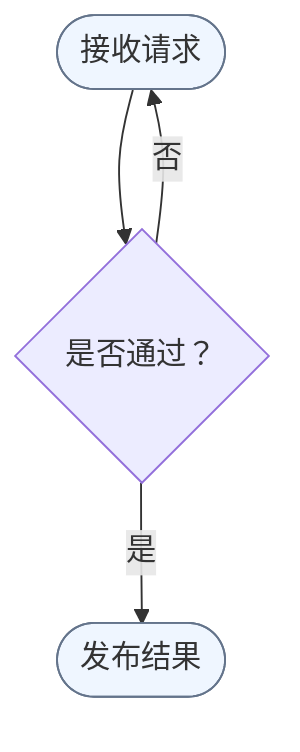
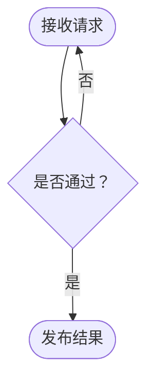
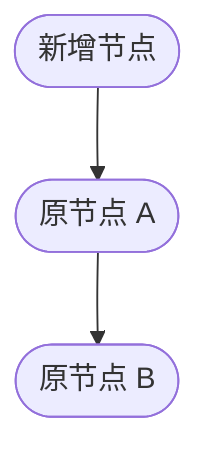

# 1. Mermaid 流程图规范

用于处理 Markdown 内嵌 Mermaid `flowchart` 的源码格式和组织。只在 `chinese-markdown` 已确认目标为 Markdown 并选择 `mermaid_diagram` 后读取，不作为非 Markdown 目标的独立处理入口。

先选择处理深度，再执行达到用户目标所需的最小改动。节点文案、连接关系和图示结论始终保持不变。

将现有代码块第一条非空、非注释语句识别为图声明；仅当该语句声明 `flowchart` 时适用。新建代码块仅在用户明确指定 `flowchart` 时适用。代码块为空、缺少声明或声明无法识别时，按「校验与失败恢复」处理。

新建流程图时，只使用用户已经提供或确认的节点、关系、分支和结论，并将其视为不变量；本文件不提供业务内容设计规则。

| task | section |
| --- | --- |
| 只整理缩进、空行或可读性 | 选择 `surface_format`，读取「处理深度」 |
| 整理节点定义、连接关系和样式顺序 | 选择 `source_organization`，读取「处理深度」和「源码组织」 |
| 调整节点 ID | 读取「节点 ID」 |
| 合并或重排连接语句 | 读取「连接关系」 |
| 修改、新建或交付流程图 | 读取「校验与失败恢复」和「检查清单」 |

# 2. 处理深度

| depth | match_signal | action |
| --- | --- | --- |
| `surface_format` | 用户只说「整理」「格式化」「调整可读性」，没有明确要求重组源码 | 只调整缩进、空行和不会改变语句顺序的机械格式；保留节点定义与连接语句的原有组织方式 |
| `source_organization` | 用户明确要求分离节点定义与连接、统一源码组织，或指定按本规范整理结构 | 按「源码组织」重排定义、连接和样式；逐项验证不变量 |
| `id_refactor` | 用户明确要求调整节点 ID，或已确认允许相应差异 | 读取「节点 ID」，同步更新全部引用后验证 |

用户意图无法区分 `surface_format` 和 `source_organization` 时，默认选择 `surface_format`。只有更深处理是完成用户明确目标的必要条件时，才进入下一层。

`surface_format` 使用以下稳定目标：

- `flowchart` 声明和顶层语句不缩进
- `subgraph ... end` 内的语句使用 4 个半角空格缩进，嵌套层级每级再增加 4 个空格
- 删除行尾空格，不改变任何语句、注释或边的相对顺序
- 相邻语句已经依次形成图声明、完整子图块、连接关系和样式定义时，各组之间保留一个空行；语句交错时不为制造分组而重排

# 3. 源码组织

本节只在选择 `source_organization` 后应用。

| phase | requirement |
| --- | --- |
| 图声明 | 先声明 `flowchart` 类型和方向 |
| 节点定义 | 逐行定义全部节点和子图；子图节点在 `subgraph ... end` 内完成定义 |
| 连接关系 | 全部节点和子图定义完成后，集中声明子图内部关系和跨子图关系 |
| 样式定义 | 将 `classDef`、`class`、`style` 和 `linkStyle` 放在连接关系之后；节点定义中的 `:::className` 可以保留 |

连接语句只引用已经定义的节点或子图 ID，不重复填写节点形状和显示文本。

# 4. 节点 ID

- 经常调整的流程图优先使用含义稳定的语义 ID，例如 `request`、`validate`、`publish`
- 已使用字母或整数顺序型 ID 的流程图保持原命名体系，不混用 `A0`、`1.0` 等临时拼接 ID
- 插入节点且变更范围允许时，重新编号受影响节点，并同步更新连接、`class`、`style` 和其他 ID 引用
- 重新编号会产生大范围无关差异时，保留既有 ID，给新节点使用同体系中下一个未占用 ID，并在结果中说明节点 ID 不再表示流程顺序

# 5. 连接关系

- 连续、无分支、无标签且不需要独立边样式或注释的路径合并为一条连接语句，例如 `prepare --> validate --> publish`
- 分支、回环、带标签关系以及需要独立边样式或注释的连接分别声明
- 存在按边声明顺序定位的 `linkStyle` 时，默认保持连接语句和边的声明顺序；只有同步更新并验证全部边序号引用时才能合并或重排
- 调整连接语句的书写方式后，逐条确认起点、终点、方向和标签没有变化

# 6. 校验与失败恢复

整理前记录流程图方向、节点 ID、节点文案、节点形状、子图归属、连接起点和终点、连接方向、边标签、边声明顺序、`linkStyle` 边序号及样式目标。整理后逐项比对这些不变量。

| condition | action | output |
| --- | --- | --- |
| 新建流程图但用户未明确起点、终点、关键节点、顺序或分支结果 | 🔴 CHECKPOINT：请求用户补齐图示语义，不提供候选业务内容 | 用户确认节点、关系、分支和结论后再创建 |
| 现有代码块为空、第一条非空且非注释语句缺少图声明或声明无法识别 | 🛑 STOP：保留原始源码并报告声明问题 | 用户明确扩大为 Mermaid 语法修复任务后重新处理 |
| 当前环境已有 Mermaid 解析或渲染入口 | 原图先验证，整理后再次验证；新建流程图只验证结果 | 只有整理结果通过时才交付 |
| 原图通过但整理结果失败 | 恢复该代码块的原始源码 | 报告失败位置和未应用的整理项 |
| 原图已经无法解析 | 🛑 STOP：保留原始源码，不继续重组 | 报告解析错误，等待用户确认是否扩大为语法修复任务 |
| 当前环境没有已知的解析或渲染入口 | 不安装新依赖，完成当前处理深度对应的人工检查 | 明确说明未执行渲染验证，不声称已通过解析 |

# 7. 检查清单

- 调用方已确认目标是 Markdown，并将当前代码块路由为 `flowchart`
- 已选择 `surface_format`、`source_organization` 或 `id_refactor`，且没有执行更深层级的非必要改动
- 节点文案、形状、子图归属、连接方向、边标签和图示结论保持不变
- 选择 `source_organization` 时，节点先定义、连接后声明，样式位于连接关系之后
- 节点 ID、连接顺序和 `linkStyle` 引用保持有效
- 有解析或渲染入口时结果通过；没有入口时已说明未执行验证

# 8. 示例

选择 `source_organization` 时的正确示例：

选择 `source_organization` 时的错误示例：

错误原因：在 `source_organization` 范围内，节点在连接语句中首次定义，节点声明与连接关系混杂。选择 `surface_format` 时应保留原有语句组织，不把它视为必须修复的问题。

顺序型 ID 的插入调整：

如果重新编号会扩大无关差异，则保持既有 ID，并使用下一个未占用 ID：

不要使用 `A0`、`1.0` 等临时拼接 ID 规避重新编号或稳定 ID 选择。
